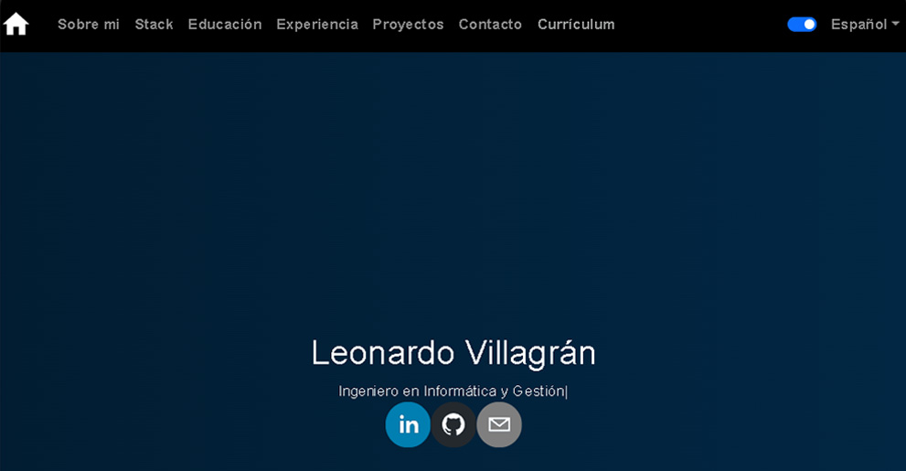

## React Portfolio-ts Website

Este es un ejemplo básico de una aplicación de portafolio utilizando React y Typescript para la navegación. La aplicación incluye una barra de navegación, secciones para la página de inicio, sobre mí, habilidades, educación, experiencias, proyectos y contacto. Se pueden personalizar los contenidos de cada sección editando los archivos JSON correspondientes. También se incluye un sistema de contacto que utiliza EmailJS para enviar emails a través de los servicios configurados con las credenciales proporcionadas.

Pueden ver el ejemplo en el siguiente enlace desde Netlify: [https://leonardo-villagran-portfolio-ts.netlify.app/](https://leonardo-villagran-portfolio-ts.netlify.app)

Pueden ver el ejemplo en el siguiente enlace desde Render.com: [https://portfolio-ts-wkho.onrender.com/](https://portfolio-ts-wkho.onrender.com/)




## Índice

- [Instrucciones de Uso](#instrucciones-de-uso)
    - [1. Clonar el Repositorio](#1-clonar-el-repositorio)
    - [2. Instalar Dependencias](#2-instalar-dependencias)
    - [3. Iniciar la Aplicación](#3-iniciar-la-aplicación)
- [Estructura del Proyecto](#estructura-del-proyecto)
- [Configuración de las Rutas](#configuración-de-las-rutas)
- [Dependencias Utilizadas](#dependencias-utilizadas)
    - [Dependencias](#dependencias)
    - [Dependencias de desarrollo (devDependencies)](#dependencias-de-desarrollo-devdependencies)

- [Personalización](#personalización)
- [Configuración del sistema de contacto](#configuración-del-sistema-de-contacto)
- [Cómo subir el portafolio a GitHub Pages](#cómo-subir-el-portafolio-a-github-pages)
- [Cómo subir a render.com](#cómo-subir-a-rendercom)


### Instrucciones de Uso

Sigue estos pasos para configurar y ejecutar la aplicación en tu entorno local.

#### 1. Clonar el Repositorio

```bash
git clone https://github.com/Leonardo-villagran/portfolio-ts
cd portfolio-ts
```

#### 2. Instalar Dependencias

```bash
npm install
```

#### 3. Iniciar la Aplicación

```bash
npm run dev
```

La aplicación se ejecutará en modo de desarrollo. Abre [http://localhost:4173/](http://localhost:4173/) en tu navegador para verla.

### Estructura del Proyecto

- **`src/components/`** Contiene los componentes con el código de programación de Home, About, Skills, Education, Experiences, Projects, Contact. 
- **`src/App.jsx`**: Archivo principal que configura las rutas y utiliza React Router.

### Configuración de las Rutas

El archivo `src/App.jsx` utiliza React Router para manejar las rutas de la aplicación. A continuación, se describen las rutas disponibles:

- `/`: Página de inicio.
- `/about`: Página "Sobre Mí".
- `/skills`: Página de habilidades.
- `/education`: Página de educación.
- `/experiences`: Página de experiencias.
- `/projects`: Página de proyectos.
- `/contact`: Página de contacto.
- `/currículum`: Link a mi currículum en google drive

Puedes personalizar estas rutas según tus necesidades y agregar más rutas según sea necesario.

Estas son las dependencias más importantes listadas en el archivo `package.json` y su propósito en el proyecto:

### Dependencias utilizadas:

#### Dependencias:

1. **@emailjs/browser**:
   - Esta es una biblioteca que permite enviar correos electrónicos directamente desde el navegador utilizando JavaScript.

2. **axios**:
   - Axios es un cliente HTTP basado en Promesas que se utiliza para realizar solicitudes HTTP, como solicitudes GET, POST, etc.

3. **bootstrap**:
   - Bootstrap es un marco de trabajo de diseño front-end popular que proporciona una estructura y componentes predefinidos para desarrollar rápidamente interfaces de usuario atractivas y receptivas.

4. **react**:
   - React es una biblioteca de JavaScript de código abierto utilizada para construir interfaces de usuario (UI) interactivas de una sola página.

5. **react-bootstrap**:
   - React Bootstrap es una versión de Bootstrap reescrita para React. Proporciona componentes de interfaz de usuario de Bootstrap como componentes React.

6. **react-chrono**:
   - React Chrono es una biblioteca para crear líneas de tiempo interactivas y visualmente atractivas en aplicaciones web de React.

7. **react-dom**:
   - React DOM es un paquete que proporciona métodos específicos para manipular el DOM de HTML en aplicaciones web de React.

8. **react-hook-form**:
   - React Hook Form es una biblioteca de React que se utiliza para gestionar formularios de manera eficiente y sencilla mediante el uso de ganchos (hooks).

9. **react-router-dom**:
   - React Router DOM es una biblioteca que proporciona navegación y enrutamiento declarativos para aplicaciones web de React.

10. **react-social-icons**:
    - React Social Icons es una biblioteca que proporciona iconos sociales predefinidos para su uso en aplicaciones web de React.

11. **serve**:
    - Serve es un servidor HTTP estático simple que se utiliza principalmente para servir archivos estáticos locales durante el desarrollo de aplicaciones web.

12. **typewriter-effect**:
    - Typewriter Effect es una biblioteca que permite simular el efecto de escritura de una máquina de escribir en aplicaciones web.

#### Dependencias de desarrollo (devDependencies):

1. **@types/react**:
   - Este paquete proporciona definiciones de tipo TypeScript para React.

2. **@types/react-dom**:
   - Este paquete proporciona definiciones de tipo TypeScript para React DOM.

3. **@vitejs/plugin-react-swc**:
   - Este es un complemento para Vite, un entorno de desarrollo rápido para JavaScript y TypeScript. Ayuda a cargar archivos React utilizando el SWC (Compilador de JavaScript de Estándares Web).

4. **eslint**:
   - ESLint es una herramienta de linting para JavaScript que ayuda a identificar y corregir problemas en el código.

5. **eslint-plugin-react**:
   - Este es un complemento de ESLint que proporciona reglas específicas para proyectos de React.

6. **eslint-plugin-react-hooks**:
   - Este es un complemento de ESLint que proporciona reglas específicas para los ganchos (hooks) de React.

7. **eslint-plugin-react-refresh**:
   - Este es un complemento de ESLint que proporciona soporte para la recarga de React.

8. **gh-pages**:
   - Gh-pages es una herramienta que facilita la implementación de aplicaciones web en GitHub Pages.

9. **vite**:
   - Vite es un entorno de desarrollo rápido para proyectos de JavaScript y TypeScript que se basa en ESM (Módulos de JavaScript Estándar).

### Personalización

Si deseas personalizar y adaptar este portafolio para tu propio uso, sigue estos pasos:

**Modificar Contenidos:**

   - Todos los contenidos de las secciones (Inicio, Sobre Mí, Habilidades, Educación, Experiencias, Proyectos, Contacto) están almacenados en archivos JSON dentro de la carpeta `public/json/`.

   - Puedes editar estos archivos JSON (`home.json`, `about.json`, `skills.json`, etc.) para reflejar tus propios datos y detalles.

### Configuración del sistema de contacto

Para configurar el sistema de contacto, sigue estos pasos:

1. Crea una cuenta en [EmailJS](https://www.emailjs.com/).

2. Obtén tu service ID, template ID y public user ID de EmailJS. Asegúrate de crear el template del email necesario.

3. Crea un archivo `.env` en la raíz del proyecto y agrega las siguientes variables de entorno con los datos obtenidos de EmailJS:

    ```dotenv
    VITE_SERVICE_ID=tu_service_ID
    VITE_TEMPLATE_ID=tu_template_ID
    VITE_USER_ID=tu_user_ID

    ```

   Asegúrate de reemplazar `'tu_service_ID'`, `'tu_template_ID'` y `'tu_user_ID'` con los valores específicos que obtuviste de EmailJS.

Con estos pasos, habrás configurado correctamente el sistema de contacto en tu aplicación. Este sistema utiliza EmailJS para enviar emails a través de los servicios configurados con las credenciales proporcionadas.

### Cómo subir el portafolio a Netlify

Para llevar a cabo la publicación de tu portafolio en Netlify, sigue estas indicaciones:

1. Subir tu proyecto a GitHub:
Asegúrate de que tu proyecto se encuentra en un repositorio de GitHub. Si no lo has hecho, inicializa un repositorio git en tu proyecto y súbelo a GitHub.

2. Crear un nuevo sitio en Netlify:
Ve a la página web de Netlify y crea una cuenta si aún no la tienes. Después de iniciar sesión, haz clic en el botón `Add new site`,  luego presiona `Import an existing project` y selecciona `Deploy with Github ` sigue los pasos para conectar tu repositorio de GitHub.

3. Configurar las variables de entorno en Netlify:
Una vez que hayas conectado tu repositorio de GitHub, ve a la sección "Site settings" o "Site configuration" en Netlify. Busca la opción para configurar las variables de entorno y agrega las variables VITE_SERVICE_ID, VITE_TEMPLATE_ID y VITE_USER_ID con sus respectivos valores.

Configurar el comando de construcción en Netlify:
En la misma sección de configuración de Netlify, asegúrate de configurar el comando de construcción de tu proyecto. Para proyectos React Vite, el comando de construcción suele ser npm run build.

Despliegue automático desde GitHub:
Netlify puede configurarse para desplegar automáticamente tu sitio cada vez que hagas un push a tu repositorio de GitHub. Esto se puede configurar desde la sección "Deploys" en Netlify.

Una vez completados estos pasos, Netlify debería desplegar automáticamente tu aplicación React Vite desde GitHub con las variables de entorno configuradas. Asegúrate de que tu aplicación funciona correctamente después del despliegue.

### Cómo subir a render.com

1. Ingresar a render.com.

2. Conectarse a Render a través de GitHub.


3. Accede al Dashboard y haz clic en el botón llamado `New +`, luego selecciona "Web service".


4. Debes dar permisos y seleccionar el proyecto desde GitHub. 


5. Una vez seleccionado el proyecto /portfolio-ts, configura el proyecto; primero escribe un nombre y luego selecciona el runtime como Node o Docker. En este caso, lo realizaré con Node. 


6. Para instalar y construir, puedes dejar la configuración por defecto. Para iniciar el servicio, utiliza `npm run serve` u otro comando que consideres mejor.


7. Seleccionar la instancia Free (si no quieres pagar). Luego bajen y verán una sección llamada `Environment Variables` (si no se ve presionen el botón `advanced` y la encontrarás allí). Puedes ingresar las variables de entorno una a una o copiarlas todas dentro de la sección llamada `Add from .env`


8. Luego presionan el botón llamado `Create Web Service` y espera a que se ejecute el deploy. Si hay errores, debes corregir el problema y volver a ejecutar el deploy. En caso de que se realicen cambios en el repositorio de GitHub, se realizará el deploy nuevamente de forma automática.


9. Para poder acceder a la web, haz clic sobre el nombre del proyecto en el Dashboard y presiona sobre la dirección que aparece debajo del repositorio de GitHub.


Con estos pasos, ya podrás acceder a tu portafolio desde Render.

